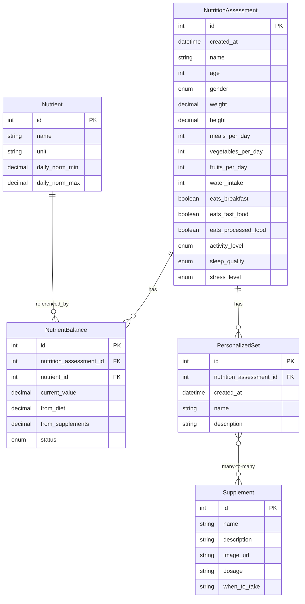

# Database Schema Diagram

## Entity Relationship Diagram

## Database Tables

### NutritionAssessments
Stores user nutrition assessment data including personal information, dietary habits, and lifestyle factors.

### Nutrients
Contains reference data for various nutrients with their daily recommended values.

### NutrientBalances
Links nutrition assessments with specific nutrients, tracking current values and sources.

### PersonalizedSets
Custom supplement sets created for specific nutrition assessments.

### Supplements
Reference data for available supplements with dosage and usage information.